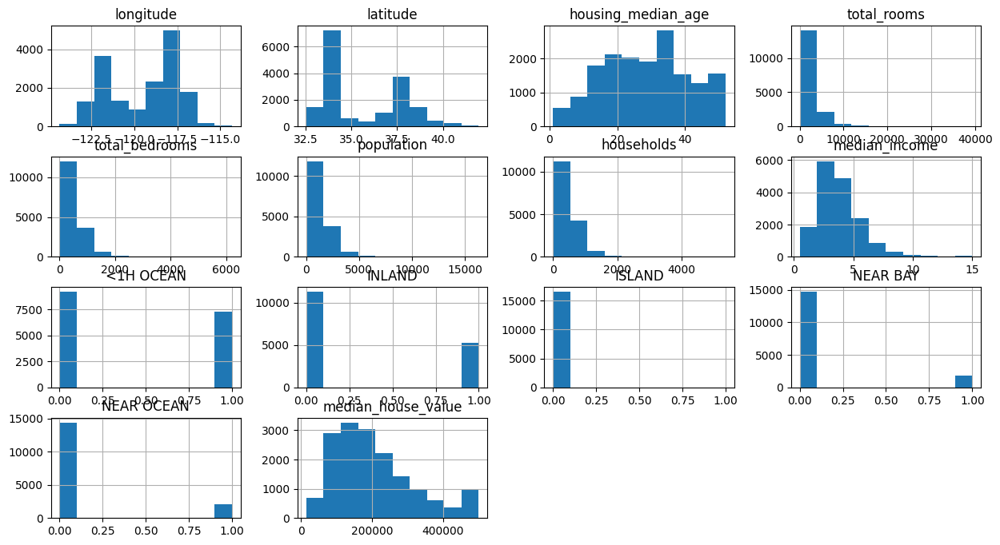
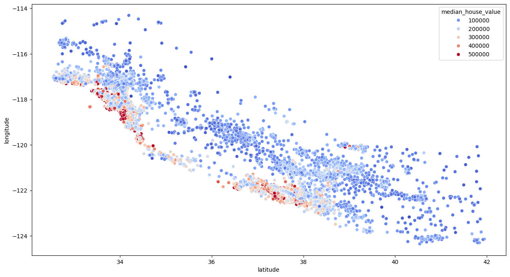

# California Housing Price Prediction 🏠

## Overview

This project predicts housing prices using the California Housing dataset. The workflow includes data preprocessing, feature engineering, visualization, model training, and hyperparameter tuning using a Random Forest model.

## Dataset

California Housing dataset from Kaggle containing information about housing blocks in California such as population, income, and geographic location.

## Data Preprocessing

Steps performed:

* Removed NaN values
* Added engineered features
* Converted categorical column to binary columns using one-hot encoding
* Feature scaling
* Train-test splitting

## Exploratory Data Analysis

### Histogram

Some features showed **right skewness** in their distribution.

To correct this, **log transformation** was applied.

### Scatter Plot

Scatter analysis showed that **houses closer to coastal regions tend to have higher prices**.

## Model

Model used:

Random Forest Regressor

Hyperparameter tuning performed using GridSearchCV to find the best estimator.

Parameters tuned:

* n_estimators
* min_samples_split
* max_depth

## Workflow

1. Data cleaning
2. Feature engineering
3. Encoding categorical data
4. Feature scaling
5. Train-test split
6. Model training
7. Hyperparameter tuning
8. Model evaluation

## Technologies

* Python
* Pandas
* NumPy
* Matplotlib
* Scikit-learn
* Jupyter Notebook

## Author

Rudram Dindorkar
